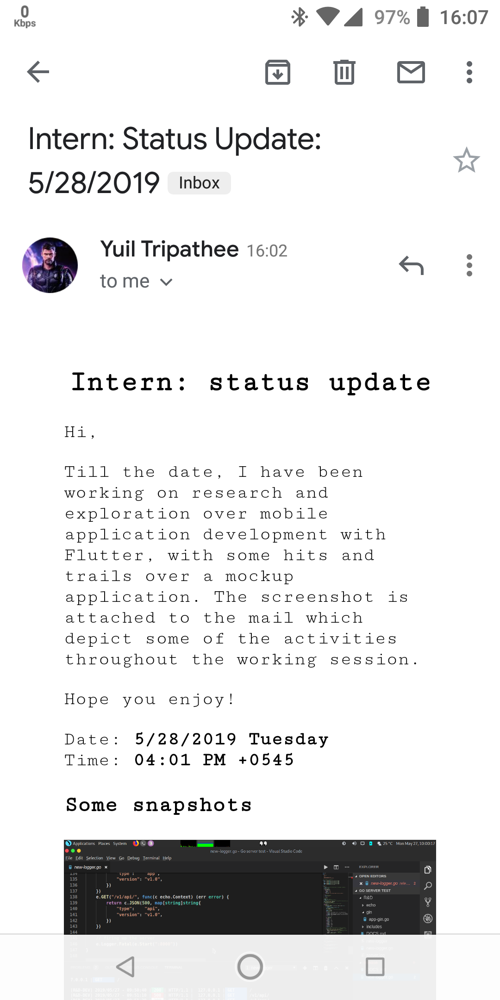
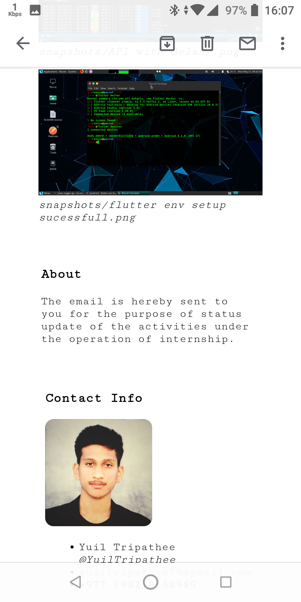
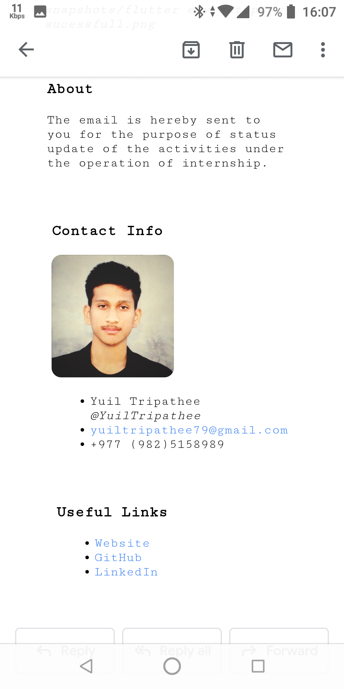

# Auto Progress Update

## User manual

### Usage algorithm

This is for extended version since minified version is much intuitive to use.
Here's how to use this program:

1. Run the program
   > `python3 mail_confirm.py`
2. Choose if you are ready to send the email. Options [y/N]
3. Check if sender information is correct. Edit by entering `N` or enter `y` if the information is correct.
4. Check if the receiver informatio is correct. Enter by entering `N` or enter `y` if the information is correct.
5. Check if the cc list is correct. Enter `y` if the list is correct or enter `N` and the cc list will be discarded (no cc in the mail you'll be sending).
6. Choose if you would consider using the predefined template for mail message. The message will be in HTML and few of the message templates may be stored in project directory : `message\template.json`. Enter `y` if you'll use the template or enter `N` if you are not using it.
   1. The available templates with the label will be  presented. Choose if you are going to use from the defined template `y` or write in on your own `N`.
   2. If you choose `y`: Enter the template id from the list presented above (with the label), note that you are only entering the id number.
   3. If you choose `N`: Enter the template message, as new line is left empty and you press enter, you can't write multiline template any more for a while. Enter the label for the custom template you just made. The template will then be saved to your project directory in `message\template.json` so that you could use it later.
7. Choose if you are adding some extra text other than a template; enter `y` if you are or enter `N` if you are not going to enter some extra texts below the template. Here, multiline input implies the same rule as you were writing for a custom template.
8. Then, images will be attached from `snapshots\` folder and the mail page will be properly rendered and saved as `mail\mail.html`. The file will then be loaded into the main `sendmail.py` scipt.
9. Enter you password to log in to the email provider (`smtp.gmail.com:587` in this case: you can change if you need to).
10. As you log in, the mail will be sent to the recipent with the cc in presence of validity of configuration you've provided earlier.

### Demo

Demo in bash (MATE desktop environment):

```c
Would you like to send status update e-mail: [y/N]
y
{'name': 'Yuil Tripathee', 'email': 'yuiltripathee79@gmail.com'}
Is the given sender information correct? y
{'name': 'Yuil Tripathee', 'email': 'yuiltripathee79@gmail.com'}
Is the given recipent's information correct? y
[]
Is the given cc list information correct? y

Would you consider using a template? [y/N]
y

Available templates:
====================
0: Working on mockup

Would you choose to use template or write on your own? [y/N]
y

Enter the template id: 0
Do you need to add extra text other than tempate? [y/N]
y

Feel comfortable writing text in HTML format:
===============================================

Hope you enjoy!

Template written sucessfully!

Embedding image reference...
<image:1> :snapshots/API with Golang.png
<image:2> :snapshots/flutter env setup sucessfull.png

Image reference added sucessfully!

Mail page written sucessfully!
Yuil, you have to provide your e-mail password in order to login to SMTP.
Password: ************
Logged in sucessfully!
Sending mail...
Mail sent sucessfully

```

## Mail format


<br>
Part 1
<br>


<br>
Part 2
<br>


<br>
Part 3

## Conventions for program operation

### Config file convention

Sender's:

```json
{
    "name" : "Yuil Tripathee",
    "email" : "yuiltripathee79@gmail.com"
}
```

Receiver's:

```json
{
    "name" : "Yuil Tripathee",
    "email" : "yuiltripathee79@gmail.com"
}
```

CC's:

```json
[
    {
        "name" : "John Doe",
        "email" : "johndoe@example.com"
    },
    {
        "name" : "John Doe",
        "email" : "johndoe@example.com"
    },
    {
        "name" : "John Doe",
        "email" : "johndoe@example.com"
    }
]
```

### Image file conventions

1. File formats: **jpg, png, gif**
2. File name: **rename on the basis of activity**
3. File location:
   >`snapshots\`

## Decoding file and their roles

1. `mail_confirm.py` Select if the mail is to be sent and which mode (either standard or extended) if to be sent.

## File contents documentation

```bash
.
├── attachments # attachments to be sent via the mail
│   └── document.pdf # sample attachment for testing purposes
├── config # configuration files for extended mailer bot version
│   ├── cc_list_backup_schema.json # for file structure backup
│   ├── cc_list.json # cc information
│   ├── recipent.json # recipent information
│   └── sender.json # sender information
├── html_mail_writer.py # mail page writer script for extended mailer bot version
├── LICENSE # MIT licensed project
├── mail
│   ├── mail.html # template sample for extended mailer bot version
│   └── min.html # template sample for minified mailer bot version
├── mail_confirm.py # for selection of mailer bot variant to be executed
├── MailerAuto -> /home/ronnie/Programs/MailerAuto/start.sh # pwd
├── mail_util.py # scripts for utilities in mailer bot
├── message # mail content templates
│   ├── templates.json # message templates for extended mailer bot version
│   └── title.json # title templates for extended mailer bot version
├── min # minified version of bot (optimized for convenience)
│   ├── data
│   │   └── main.json # collection of templates of mailing information
│   ├── html_mail_writer.py # minified version of mail page writer engine
│   └── sendmail.py # minified version of mail sender
├── mstart.sh # dummy project starter (for testing - untracked)
├── notes.md # technical documentation (to document R & D findings)
├── README.md # project documentation
├── res # resources folder for documentation (sampling of the email)
│   ├── part_1.png
│   ├── part_2.png
│   └── part_3.png
├── sendmail.py
├── snapshots # folder where snapshots are recorded
│   ├── API with Golang.png # some sample snapshots
│   └── flutter env setup sucessfull.png
└── start.sh # script that runs the mailer bot
```

## Program flow

```txt

start.sh
|
v
mail_confirm.py
| |
| |-----> min/sendmail.py <--> min/html_mail_writer.py
|-------> sendmail.py <--> html_mail_writer.py

Hence, the bot is able to send mail via SMTP protocol in MIME format.

mail_util.py # for mail utilities
```